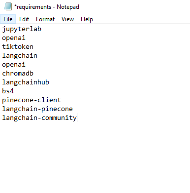
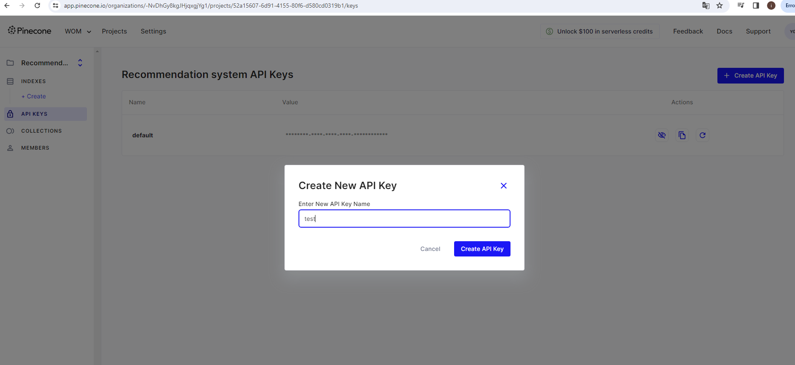
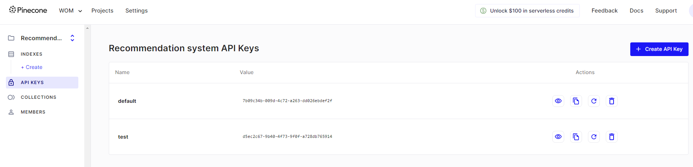
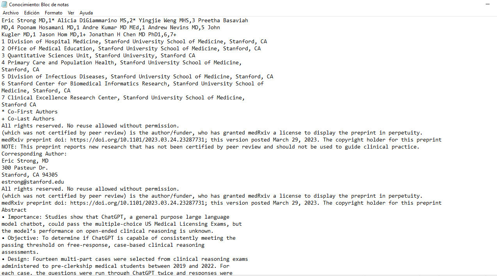
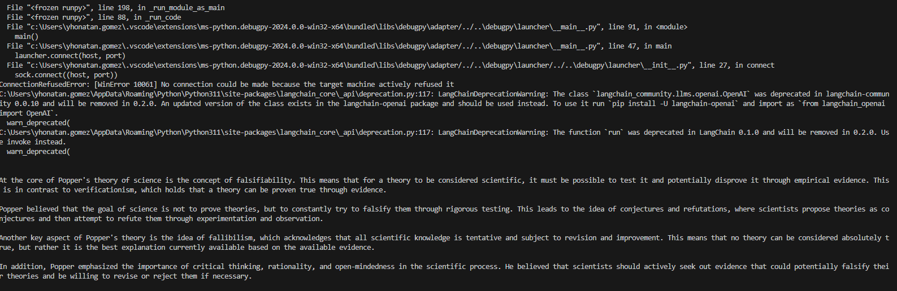
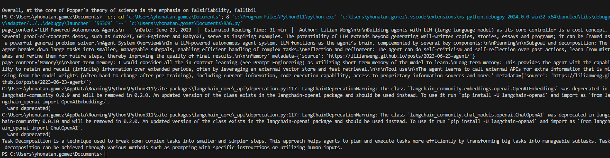
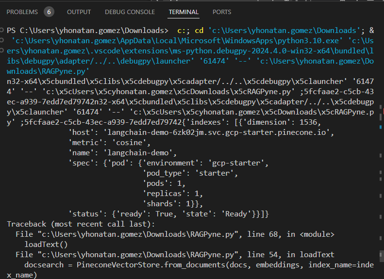
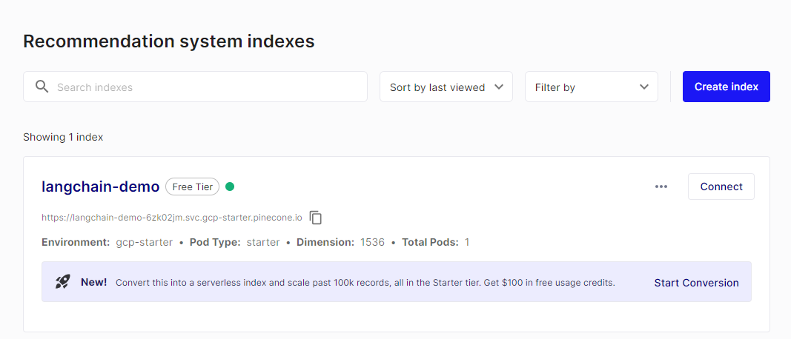
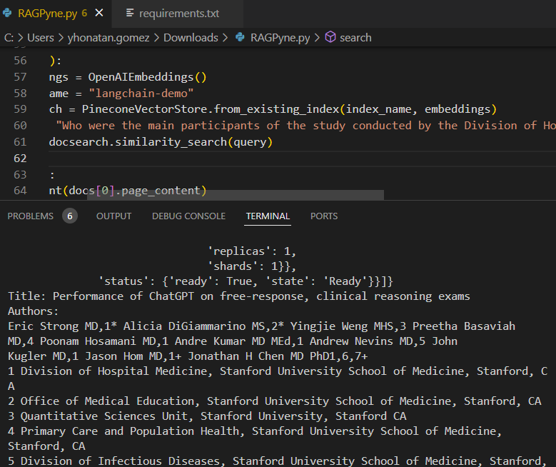

# Taller LLM

## Descripción General
Este taller comprende una serie de programas en Python diseñados para explorar las aplicaciones de LangChain, Pinecone y OpenAI en el procesamiento de lenguaje natural (NLP) y la recuperación de información. A través de estos ejercicios, los participantes aprenderán a enviar consultas a modelos avanzados de lenguaje, manejar bases de datos de vectores en memoria y utilizar servicios de vectorización en la nube.

## Guía de Inicio Rápido

### Prerrequisitos:
- Python
- Git

### Clonar el Repositorio:
```bash
git clone https://github.com/YhonatanGoomez/AREP-LLM.git
cd /AREP-LLM
```
### Instalación:
Instala los paquetes Python necesarios con el siguiente comando:

```bash
pip install -r requirements.txt
```


### Ejecución de Programas:
Para ejecutar cualquier script:

```bash
python <nombre_del_script>.py
```

### Descripción de los Desafíos
#### Enviar Mensajes a ChatGPT y Recuperar Respuestas:
Utiliza LangChain para facilitar la comunicación con el modelo ChatGPT de OpenAI, permitiendo enviar preguntas y recibir respuestas generadas.

#### Generación Aumentada con Recuperación (RAG) Utilizando una Base de Datos de Vectores en Memoria:
Implementa un sistema RAG simple para responder preguntas mediante documentos cargados en memoria, utilizando LangChain para la recuperación y generación de respuestas basadas en vectores semánticos.

Aquí tendremos que crear una cuenta en Pinecode y crear una llave



#### RAG Utilizando Pinecone para Almacenamiento de Vectores:
Extiende el concepto de RAG al integrar Pinecone para la gestión de la base de datos de vectores en la nube, demostrando un enfoque escalable para el procesamiento de NLP y recuperación de información.

Se tuvo que crear un archivo llamado Conocimiento.txt para así utilizar esta información en este desafio



### Herramientas Utilizadas
- **Python:** Lenguaje de programación principal.
- **Git:** Utilizado para el control de versiones.
- **PyCharm:** IDE recomendado para la edición de código y ejecución de los scripts.

### Configuración de API Keys
Antes de ejecutar los scripts, asegúrate de configurar las claves API necesarias para OpenAI y Pinecone en tu entorno. Estas claves se pueden obtener a través de los sitios web respectivos después de registrarse.

- **PINECONE_API_KEY:** Obtén esta clave al registrarte en Pinecone.
- **OPENAI_API_KEY:** Proporcionada por el profesor o al registrarte en OpenAI.

### Arquitectura y Flujo de Trabajo
- **test.py:** Interactúa con el modelo ChatGPT utilizando LangChain para enviar preguntas y recibir respuestas.
- **RAG.py:** Implementa un sistema RAG en memoria para responder preguntas basadas en documentos cargados y procesados localmente.
- **RAGPine.py:** Utiliza Pinecone para almacenar y recuperar vectores semánticos, permitiendo búsquedas de información eficientes y escalables.

### Ejecución de los Scripts
#### Ejemplo de ejecución de test.py
```bash
py test.py
```

#### Ejemplo de ejecución de RAG.py
```bash
py RAG.py
```

#### Ejemplo de ejecución de RAGPine.py
```bash
py RAGPine.py
```

Se crean los vectores automáticamente


Y se vería en su ejecución algo como esto, en donde podemos observar la pregunta y su funcionamiento correcto:

Cada script está diseñado para demostrar diferentes aspectos del uso de LangChain, Pinecone y OpenAI en tareas de NLP, mostrando tanto las capacidades básicas como las avanzadas de estas tecnologías en la generación y recuperación de texto.

### Autor
Yhonatan Steven Gómez Jiménez